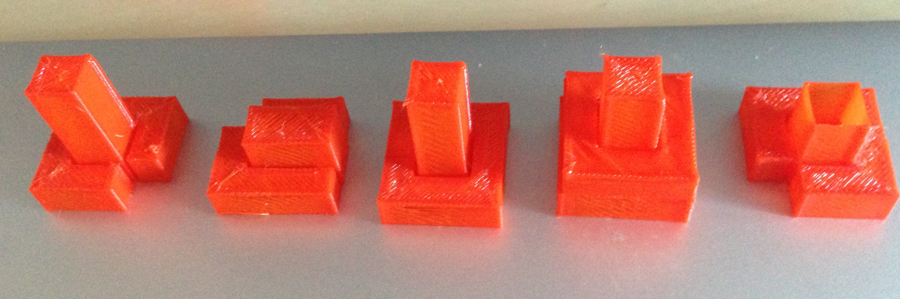
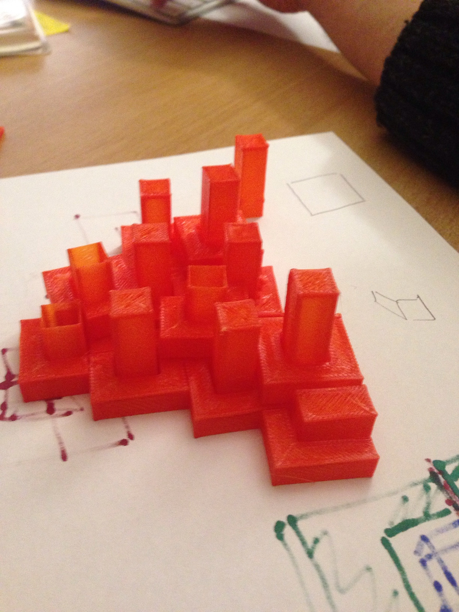
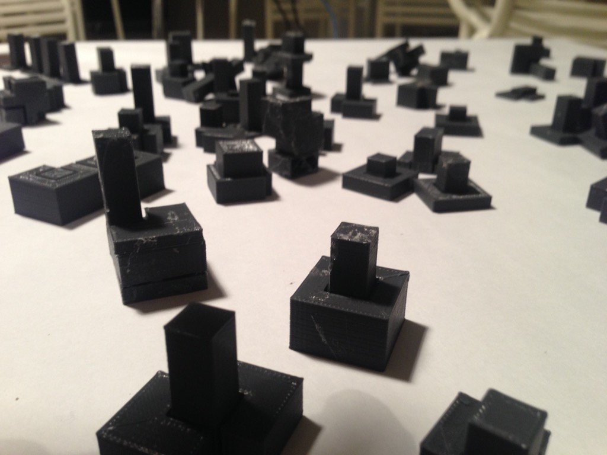
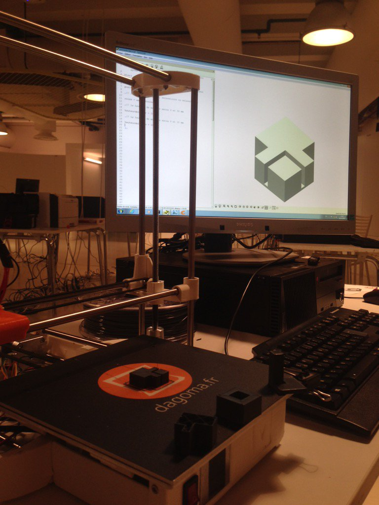
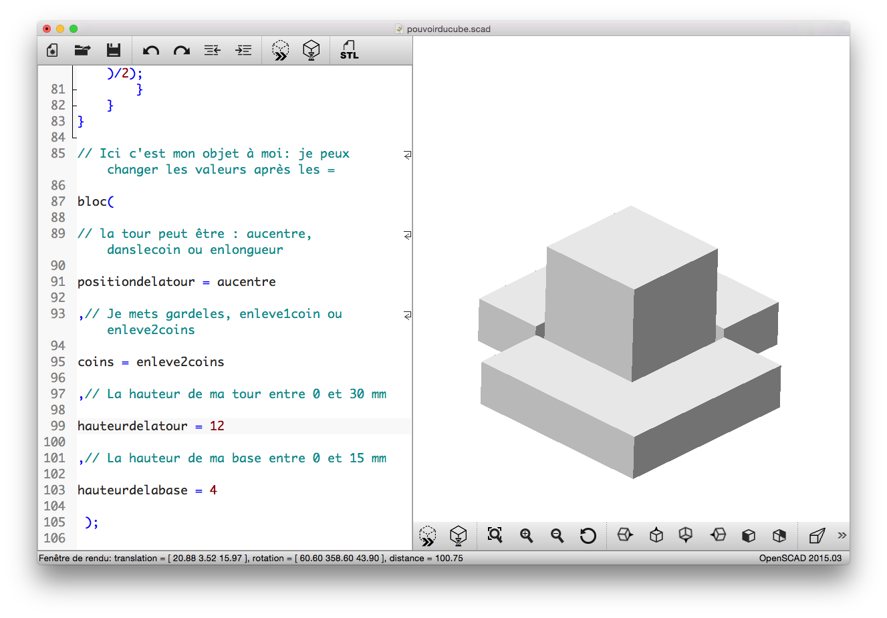
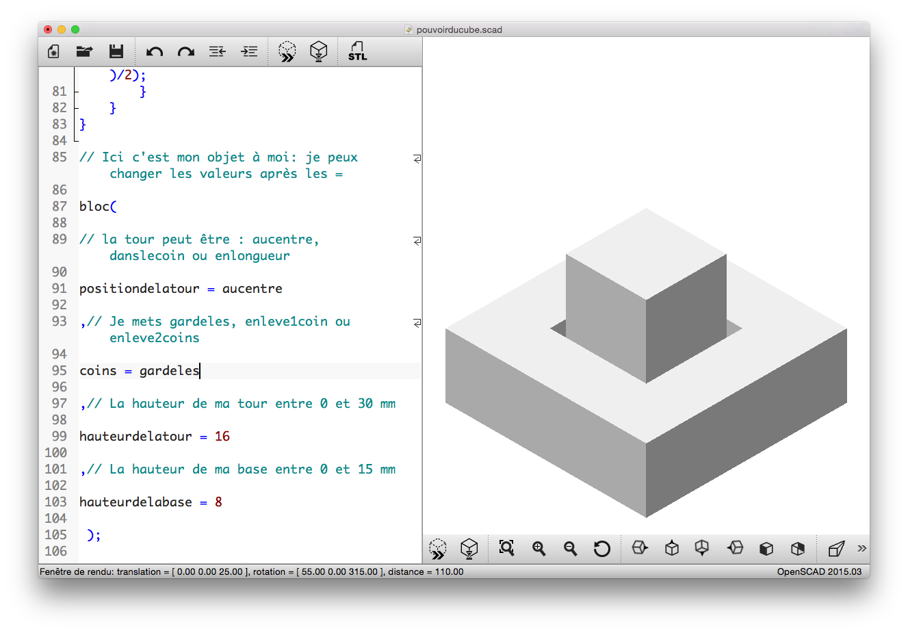
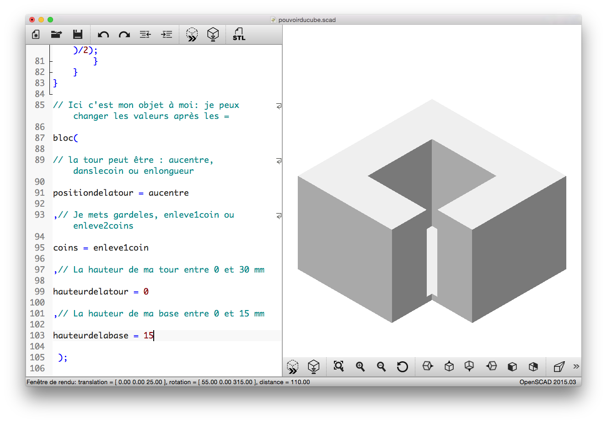
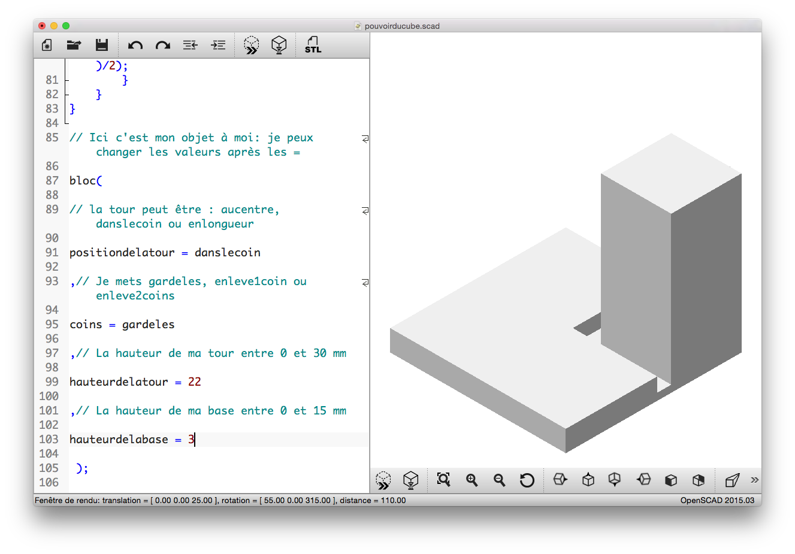
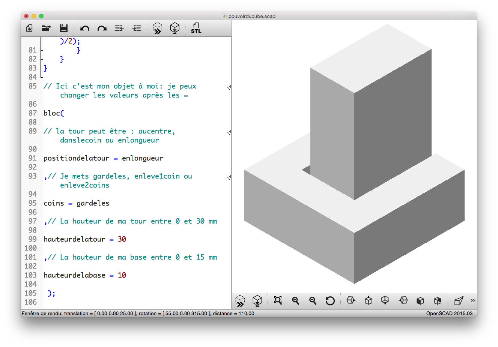
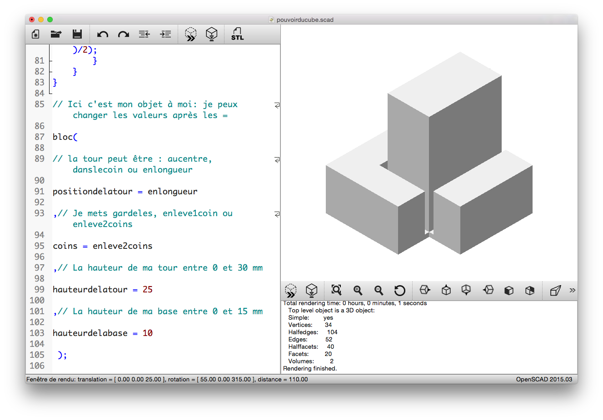

# le Pouvoir du Cube, inspiré par Malevitch

Créer des tours directement dans OpenSCAD et les imprimer en 3D pour faire grandir une ville suprématiste. 

Les enfants paramétrisent leur design : choix des formes, des hauteurs, angles (ils ont un petit "[guide](guide-atelier.pdf)" qui les aident à choisir).

Il existe potentiellement 4050 formes de tours. Durant le weekend nous en avons imprimés autour de 250 ! 

Les participants naviguent dans cet espace de possible, se rapproche étape par étape de la forme qu'ils souhaitent, puis impriment en 3D le module qu'ils ont combiné.

Certains ont même été fouiller dans le code pour créer des formes non anticipées :-)

Nous avons exploré toutes les astuces d'optimisations du temps d'impression, ce qui nous permet d'imprimer les tours rapidement, en 8 minutes en moyenne. C'est essentiel pour un atelier de type "drop-in, drop-out".

Les participants récupèrent leur module au niveau de l'imprimante et peuvent s'en servir pour faire grandir une ville collective qui rapelle les Architectones de Malevitch. Beaucoup des enfants souhaitent emporter les module chez eux, et nous avons donc imprimés de nombreuses tours en double !

Le Pouvoir du Cube est un atelier crée à la conjonction de 3 contraintes fortes : pédagogique, esthétique et technique. Chacune a informé et enrichi les autres.

Le Pouvoir du Cube est conçu et programmé par [Laurent Bossavit](http://twitter.com/morendil) et [Julien Dorra](http://twitter.com/juliendorra), en collaboration avec Odile Fayet (Chef de projet au Centre Pompidou).

[Dagoma](http://dagoma.fr) a soutenu l'atelier en mettant à disposision 10 imprimantes 3D pour tout le weekend et en nous prétant main forte sur l'animation : merci à Matthieu, Anthony, Sophie, Pascal.

### Modules de tests

### Photos de l'atelier

### Captures d'écran

