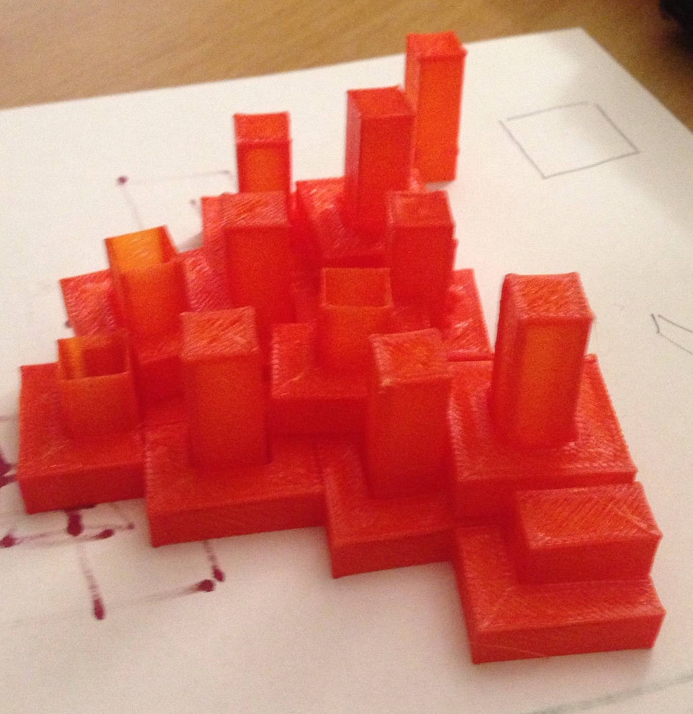
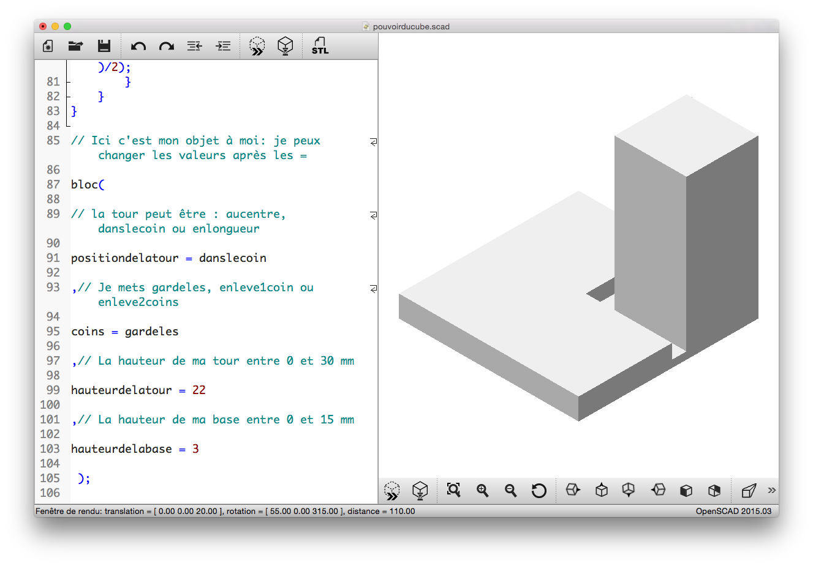

# le Pouvoir du Cube, inspiré par Malevitch

Créer des tours directement dans OpenSCAD et les imprimer en 3D pour faire grandir une ville suprématiste. Les enfants paramétrisent leur design : choix des formes, des hauteurs, angles (ils ont un document "catalogue des formes" qui les aident à choisir)

Il existe potentiellement 4050 formes de tours. Durant le weekend nous espérons en imprimer entre 100 et 200 ! 

Une fois qu'ils ont explorés plusieurs possibilités, ils peuvent imprimer en 3D le module tour qu'ils ont combiné.

Grâce à l'utilisaton de toutes les astuces d'optimisation, nous imprimons les tours très vite, 8 minutes en moyenne. C'est essentiel pour un atelier de type "drop-in, drop-out".

Les participants récupèrent leur module au niveau de l'imprimante et s'en servent, avec un point de colle ou deux, pour faire grandir une ville collective qui rapelle les Architectones de Malevitch.

Un atelier sous 3 contraintes fortes : pédagogique, esthétique et technique. Chacune a informé et enrichit les autres.

Le Pouvoir du Cube est conçu et programmé par [Laurent Bossavit](http://twitter.com/morendil) et [Julien Dorra](http://twitter.com/juliendorra), en collaboration avec Odile Fayet (Chef de projet au Centre Pompidou).

### Modules de tests

### Captures d'écran

